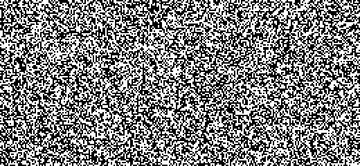

<p align="center">
  
</p>

<h1 align="center">Driftcha</h1>

<p align="center">
  <b>A motion-defined noise CAPTCHA.</b><br>
  Every frame is pure static. The digits only exist in motion.
</p>

<p align="center">
  <a href="https://github.com/kaihong66/driftcha/actions/workflows/ci.yml"></a>
  <a href="LICENSE"></a>
  
</p>

> Probably the most over-engineered CAPTCHA in the observable universe.

<p align="center">
  
  <br>
  <sub>The code in this clip is <b>7149</b>. Note the 1 is a single bar, so it never looks like a 7.</sub>
</p>

<p align="center">
  <a href="https://kaihong66.github.io/driftcha/"><b>Try the live demo</b></a>
  (browser-only mode; <a href="#quick-start">run it locally</a> for the mock server)
</p>

Driftcha hides a four-digit code in a field of flickering dots. Pause on any single
frame and you see uniform noise. Let it play, and the human visual system separates
the digits from the background because their dots _move differently_. The widget
runs two rounds (black-and-white, then full color) and puts proof-of-work and
input-integrity checks in front of every button press.

> [!IMPORTANT]
> Driftcha is experimental. It stops screenshot-and-OCR bots, but with the default
> settings a simple motion-analysis script recovers the digits from about two seconds
> of stream. Treat it as a speed bump and one layer of defense, never the only one.
> See the [security model](#security-model).

It runs in two modes:

- **Mock server** (default when a server is reachable): the server picks the code,
  renders the noise and streams raw frames to the page. Answers and proofs of work are
  checked on the server, which then signs a single-use pass token for your backend.
  The answer never reaches the browser.
- **Browser only**: everything runs in the page. Good for static hosting such as
  GitHub Pages, but the answer lives in page memory.

## Contents

- [Quick start](#quick-start)
- [Using the widget](#using-the-widget)
- [Mock server](#mock-server)
- [How it works](#how-it-works)
- [Security model](#security-model)
- [Project layout](#project-layout)
- [Development](#development)
- [License](#license)

## Quick start

Requires Node.js 20.19+ (the widget itself has no runtime dependencies).

```bash
git clone https://github.com/kaihong66/driftcha.git
cd driftcha
npm install
npm run dev
```

Open the printed URL (usually http://localhost:5173). The dev server already includes
the mock server under `/api`, and the demo page lets you switch between
**Mock server** and **Browser only**.

To try the production build with the standalone mock server:

```bash
npm run serve
```

This builds `dist/` and serves it together with the API on http://localhost:8787.

## Using the widget

```html
<link rel="stylesheet" href="driftcha/src/driftcha.css" />

<div id="captcha"></div>
<input type="hidden" name="captcha-token" id="captcha-token" />

<script type="module">
  import { createDriftcha, createServerBackend } from './driftcha/src/index.js';

  const captcha = createDriftcha('#captcha', {
    backend: createServerBackend({ endpoint: '/api' }),
    onSuccess: ({ token }) => {
      // Send the token with your form; your backend checks it via POST /api/siteverify.
      document.querySelector('#captcha-token').value = token;
    }
  });

  // later: captcha.restart(), captcha.zoom() or captcha.destroy()
</script>
```

Leave out `backend` to run everything in the browser (`createLocalBackend()`).
TypeScript declarations are included.

Driftcha isn't published on npm yet. To use it with a bundler, install it from GitHub:

```bash
npm install github:kaihong66/driftcha
```

```js
import { createDriftcha, createServerBackend } from 'driftcha';
import 'driftcha/style.css';
```

The button in the corner of the noise opens an **enlarged view**: the whole widget,
code field included, in a large modal dialog sized to fit the screen. Esc, the backdrop
or the shrink button closes it, and anything already typed is kept.

### Instance API

| Member                                    | Description                                    |
| ----------------------------------------- | ---------------------------------------------- |
| `restart()`                               | Start over from the first round (new session). |
| `zoom()` / `unzoom()` / `toggleZoom()`    | Open or close the enlarged view.               |
| `destroy()`                               | Stop everything and remove the widget.         |
| `zoomed`, `solved`, `token`, `stageIndex` | Read-only state.                               |

### Options

| Option                    | Type                               | Default                | Description                                                                                                       |
| ------------------------- | ---------------------------------- | ---------------------- | ----------------------------------------------------------------------------------------------------------------- |
| `backend`                 | backend object                     | `createLocalBackend()` | Where challenges come from: `createServerBackend({ endpoint })` or `createLocalBackend({ stages, length, pow })`. |
| `messages`                | `Partial<DEFAULT_MESSAGES>`        |                        | Override any UI string (e.g. for translations). See [`src/messages.js`](src/messages.js).                         |
| `theme`                   | `'light' \| 'dark'`                | system                 | Force a color scheme.                                                                                             |
| `autofocus`               | `boolean`                          | `false`                | Focus the code field on mount.                                                                                    |
| `onSuccess`               | `({ challengeId, token }) => void` |                        | All rounds passed. `token` is the server's pass token (`null` in browser-only mode).                              |
| `onFail`                  | `({ stage, reason }) => void`      |                        | `reason` is `'wrong'` or `'typing'`.                                                                              |
| `onStageChange`           | `({ index, stage }) => void`       |                        | A round started.                                                                                                  |
| `stages`, `length`, `pow` |                                    |                        | Shorthand for the default local backend's settings.                                                               |

### Stage parameters

Stages are configured in [`src/config.js`](src/config.js) (browser-only mode) or passed to
`createApi({ stages })` (server mode).

| Field        | Meaning                                                                                                                                         |
| ------------ | ----------------------------------------------------------------------------------------------------------------------------------------------- |
| `color`      | `false` for black-and-white dots, `true` for random RGB.                                                                                        |
| `life`       | Dot lifetime range in seconds. Shorter is harder.                                                                                               |
| `speed`      | Dot texture flow speed in px/s (raw field pixels), shared by digits and background.                                                             |
| `tilt`       | Maximum digit rotation in degrees, at full distortion.                                                                                          |
| `distortion` | Geometric distortion strength, `0` (upright, unwarped; the default) to `1` (full): rotation up to `tilt`, squash, shear, italics and wave warp. |
| `plates`     | Number of background plates (1–256).                                                                                                            |
| `decoys`     | Number of non-digit distractor shapes.                                                                                                          |
| `noise`      | Share of pixels (0–1) replaced each frame by a one-frame random dot with no motion. Default `0`.                                                |
| `jitter`     | Share of pixels (0–1) that show a random neighbour's dot each frame, so dots wobble instead of sliding rigidly. Default `0`.                    |

### Why distortion is off

Classic CAPTCHAs bend their characters to beat OCR. Here, distortion only matters
after an attacker has already separated the digits from the motion, and in testing
it barely helped even then. At full strength it tripped only weak OCR engines: one
missed digits and another added stray symbols, both of which simple post-processing
(keep digits only, read each of the four slots separately) undoes. Stronger OCR and
vision-language models read it without trouble. Meanwhile it made the digits
noticeably harder for people, so it is off (`distortion: 0`). The digit 1 is still
always drawn as a single bar, so it never reads as a 7.

To run your own comparison:

```bash
npm run glyph-samples -- --distortion 1 --count 20
```

This writes clean four-digit images (the attacker's best case) to `glyph-samples/`,
plus an `answers.txt` key. The images use the server's vector digits; browser-only
mode draws digits with system fonts instead.

### Theming

All colors, radii and sizes are CSS custom properties on `.driftcha`
(`--dc-accent`, `--dc-bg`, `--dc-radius`, …). The widget is 640 px wide at most
(`--dc-max-width`); the enlarged view goes up to 1120 px (`--dc-zoom-max-width`).

```css
.driftcha {
  --dc-accent: #0ea5e9;
  --dc-radius: 8px;
  --dc-max-width: 720px;
}
```

## Mock server

[`server/api.js`](server/api.js) is a zero-dependency reference implementation of the
server side. `createApi()` returns a `middleware(req, res, next)` that works with
`node:http`, Connect, Express and Vite:

```js
import express from 'express';
import { createApi } from 'driftcha/server';

const app = express();
app.use(createApi({ secret: process.env.DRIFTCHA_SECRET }).middleware);
```

### Flow

```
browser                                   server
───────                                   ──────
POST /api/session  ─────────────────────► picks code, issues PoW prefixes
                   ◄───────────────────── { session, stages, challenge }
GET  /api/stream   ─────────────────────► renders the noise field
                   ◄═════════════════════ binary frames, 30 fps
solve PoW (Web Worker)
POST /api/verify   ─────────────────────► checks proof, then answer
                   ◄───────────────────── wrong / next stage / solved + token

your backend
POST /api/siteverify { token } ─────────► signature, expiry, single use
                   ◄───────────────────── { success: true, challengeId }
```

### Endpoints

| Method & path          | Body                                     | Response                                                           |
| ---------------------- | ---------------------------------------- | ------------------------------------------------------------------ |
| `GET /api/health`      |                                          | `{ ok: true }`                                                     |
| `POST /api/session`    | `{ replace? }`                           | `{ session, stages, challenge }`                                   |
| `GET /api/stream`      | query: `session`, `challenge`            | Binary frame stream (see [`src/core/codec.js`](src/core/codec.js)) |
| `POST /api/verify`     | `{ session, challenge, answer, nonces }` | `{ result, challenge?, pow?, token? }`                             |
| `POST /api/reload`     | `{ session, challenge, nonces }`         | `{ result, challenge?, pow? }`                                     |
| `POST /api/siteverify` | `{ token }`                              | `{ success, challengeId?, issuedAt?, error? }`                     |

`result` is one of `wrong`, `next`, `solved`, `reloaded`, `expired`, `rejected`
(bad proof of work) or `early` (answer sent before the minimum solve time; it was not
checked and the challenge stays live). A challenge object never contains the code.
Over a rate limit, `session`, `verify` and `reload` answer HTTP 429 with `Retry-After`.

### What the server enforces

- Codes are generated, rendered and checked only on the server. Frames are streamed as
  1 bit per pixel (black-and-white round) or RGB332 (color round): about 120 kB/s and
  0.9 MB/s at 30 fps.
- Every challenge is single-use: any answer, right or wrong, burns it.
- Proof-of-work prefixes are issued by the server, bound to the challenge and action,
  and single-use. Each wrong answer in the last minute adds two bits of difficulty and
  each reload one (up to +8), counted per client IP so a fresh session doesn't reset
  them. Each bit doubles the work: at the default 16 bits a proof takes about 0.15 s in
  Node.js, two wrong answers make it about 1 s, four about 18 s (phones are slower).
- Speed bumps, which slow bots down rather than stop them:
  - **Minimum solve time.** An answer sent less than 4 s after the challenge's first
    streamed frame (or before any frame) is refused unread. People take about 8 s. A
    bot can simply wait, but it can't go faster than that.
  - **Rate limits per client IP.** 20 verify / reload requests and 10 new sessions per
    minute, on top of the open-session cap.
- Pass tokens are HMAC-signed, expire after two minutes, and verify only once.
- Limits: open sessions per IP, total sessions, concurrent streams, request body size,
  and challenge / session lifetimes.

### `createApi(options)`

| Option             | Default          | Description                                                                                             |
| ------------------ | ---------------- | ------------------------------------------------------------------------------------------------------- |
| `stages`           | `DEFAULT_STAGES` | Rounds to play.                                                                                         |
| `length`           | `4`              | Digits per code.                                                                                        |
| `pow`              | `POW`            | `bits`, `count`, `bitsPerWrong`, `bitsPerReload`, `maxPenaltyBits`, `penaltyWindow`.                    |
| `fps`              | `30`             | Stream frame rate.                                                                                      |
| `secret`           | random           | HMAC key for pass tokens. Set it if tokens must survive restarts.                                       |
| `challengeTtl`     | 5 min            | Challenge lifetime.                                                                                     |
| `sessionTtl`       | 15 min           | Idle session lifetime.                                                                                  |
| `tokenTtl`         | 2 min            | Pass token lifetime.                                                                                    |
| `maxSessions`      | `1000`           | Total open sessions.                                                                                    |
| `maxSessionsPerIp` | `30`             | Open sessions per client IP.                                                                            |
| `maxStreams`       | `64`             | Concurrent frame streams.                                                                               |
| `minSolveTime`     | 4 s              | Earliest answer after the first streamed frame. `0` disables.                                           |
| `rateLimit`        | see description  | Per IP per `window` (1 min): `attempts` (20 verify + reload), `sessions` (10). `Infinity` disables one. |
| `clientIp`         | socket address   | `req => string`. Behind a reverse proxy, read its client-address header, or everyone shares one IP.     |

The server draws digits from built-in vector stroke skeletons
([`src/core/vector-glyphs.js`](src/core/vector-glyphs.js)) because Node.js has no canvas
or fonts. Browser-only mode uses real system fonts.

## How it works

**The image.** The raw field is 260 × 120 pixels, upscaled for display. Every pixel is
a dot with a short random lifetime; when it expires it re-rolls its color.

- **Background:** cut into irregular plates (a weighted Voronoi diagram with wavy
  borders). Each plate is a field-sized dot texture that slides rigidly in its own
  random direction and turns every 0.35–0.9 s. The plate borders stay put.
- **Digits:** each digit's outline drifts slowly inside its slot, while the dots inside
  it flow at the _same speed_ as the background, only in a _different direction_.
  The direction is chosen to stand out from every plate underneath and is re-picked
  immediately if a plate starts moving the same way.
- **Display:** a slowly drifting contrast / brightness / saturation / hue grade and a
  faint random tint are applied in the browser while upscaling.

**Why there is no cheap shortcut.**

- Background and digit dots share speed, lifetime, color distribution and direction
  statistics, so "where do pixels change most" or "where do dots live longest" reveals
  nothing. Pixel change rate depends on |vx| + |vy|, so digit directions are kept
  isotropic too.
- With no dominant flow direction, "align consecutive frames and stack them" only
  lines up one small plate at a time.
- Every plate and every digit has its own independent dot texture, so a single frame
  has no structure at all.
- Font (or stroke variant), weight, size and position vary for each digit, but the
  digits stay upright and unwarped: distortion barely slows machines down and mostly
  hurts people (see [Why distortion is off](#why-distortion-is-off)). The digit **1** is
  always a single vertical stroke (like `l`, `I` or `|`), so it never reads as a 7.
- The answer comes from `crypto.getRandomValues`; the animation uses a separate
  `sfc32` PRNG seeded from it. Recovering the animation PRNG from frames says nothing
  about the answer.

**The buttons.** Verify and New code only act after:

1. **A click check.** Mouse clicks need a trusted press of sane length and travel, plus
   real pointer movement onto the button (no teleporting). Keyboard activation needs a
   trusted Enter/Space keydown with a non-zero hold. Screen-reader activations are
   accepted on `isTrusted` alone.
2. **A proof of work.** Four nonces with a 16-bit zero SHA-256 prefix (well under a
   second on a typical laptop). The search runs in a Web Worker so the animation never
   stutters, with a time-sliced main-thread fallback when workers are blocked.

**The code field.** Only trusted single-digit insertions count, tracked in a shadow
copy that script-set values and synthetic events cannot reach. Each digit must match a
trusted keydown; paste, drop and autocorrect are blocked; and typing rhythm and key
hold times are checked for scripted regularity.

## Security model

**Read this before using Driftcha for anything real.**

- **Browser-only mode** generates, renders and checks the challenge in the page, so the
  answer is in client memory and any script on the page can read it. It raises the cost
  of naive automation and nothing more.
- **Mock-server mode** has the right shape: the code, the shapes and the checks stay on
  the server, and the page only ever sees noise frames. A bot has to actually read the
  motion. But it is a _reference implementation_: all state is in memory (one process,
  lost on restart), the limits are simple, and it has not been hardened or load-tested.
  For production you would add persistent/shared storage (e.g. Redis), real rate
  limiting at the edge, TLS, monitoring, and capacity planning for the streaming
  bandwidth. Its per-IP limits and penalties also hit everyone behind a shared address
  (office NAT, carrier-grade NAT) together.
- The click and typing checks run in the browser. They are behavioral signals that
  filter out lazy automation; a server cannot verify them.
- Motion-based perception is exactly what a determined attacker with computer vision
  will target, and with the default settings it is easy (see below). Treat Driftcha as
  a speed bump and one layer of defense, never your only one.

### Measured: how easily can the digits be cut out?

We attacked the mock server with a simple probe that sees only the frame stream: block
matching between consecutive frames, averaged over a fraction of a second. The probe
score is how accurately digit pixels can be told from the surrounding background by
their estimated motion (50% = chance, 100% = perfect), best of three block sizes and
averaging windows, 3 challenges each. The human column is one tester using the lab page.

| Motion settings                                      | Probe accuracy | A person                                    |
| ---------------------------------------------------- | -------------- | ------------------------------------------- |
| Default: `life 0.22–0.55 s`, no `noise`, no `jitter` | ~93%           | ~2 s per digit, almost never wrong          |
| Short dot life: `life 0.03–0.07 s`                   | ~85%           |                                             |
| `noise 0.5`                                          | ~78%           |                                             |
| `life 0.06–0.12 s`, `noise 0.3`, `jitter 0.3`        | ~72%           | ~3 s per digit, 1–2 digits wrong most times |
| `life 0.05–0.10 s`, `noise 0.5`, `jitter 0.5`        | ~59%           | unreadable                                  |

What this means:

- **With the defaults, the digits come out cleanly.** About two seconds of stream and
  half a second of computing produce a motion image that reads like printed text, for
  any OCR engine or vision-language model. The machine is faster than a person.
- **Tuning does not open a gap.** `noise`, `jitter` and short dot lives push the probe
  toward chance, but people lose the digits at about the same point. Wherever a person
  reads reliably, this simple probe separates the digits well, and a stronger attacker
  (for example a neural network trained on unlimited labeled frames from this
  open-source engine) would do better still.
- **So Driftcha is a speed bump, not a defense.** It stops screenshot-and-OCR bots and
  forces an attacker to write motion analysis, and in mock-server mode each attempt
  costs a session, a proof of work and a few seconds of streaming. Any protection beyond
  that comes from server-side limits, not from the image. The defaults favour people;
  the knobs remain for experiments (`/lab/` on the dev server).

Also note: a motion-only CAPTCHA cannot be solved by blind users and may be hard for
some people with low vision or motion sensitivity. Always offer an accessible
alternative.

## Project layout

```
driftcha/
├── index.html              Demo page
├── lab/                    Tuning lab: live settings + your own accuracy (dev server, /lab/)
├── demo/                   Demo script and styles, logo.svg, favicon.svg
├── docs/                   README GIF, social preview image and its HTML source
├── scripts/demo-gif.mjs    Renders the README GIF from the noise engine
├── server/
│   ├── api.js              Mock server: sessions, frame streaming, checks, tokens
│   ├── api.d.ts            Its TypeScript declarations
│   └── index.js            Standalone server (API + built demo)
├── src/
│   ├── index.js            Public API
│   ├── index.d.ts          TypeScript declarations
│   ├── driftcha.js         Widget: DOM, flow, PoW-protected buttons
│   ├── driftcha.css        Widget styles (themable via --dc-* properties)
│   ├── config.js           Field size, default stages, PoW defaults
│   ├── messages.js         UI strings
│   ├── backends/
│   │   ├── local.js        Browser-only backend
│   │   └── server.js       Server backend + streamed frame source
│   ├── core/
│   │   ├── scene.js        Raw noise field (DOM-free; runs in Node too)
│   │   ├── plates.js       Background plates
│   │   ├── layer.js        Digit / decoy layers
│   │   ├── canvas-glyphs.js  Digit masks from system fonts (browser)
│   │   ├── vector-glyphs.js  Digit masks from stroke skeletons (server)
│   │   ├── mask.js         Shared warp + crop
│   │   ├── codec.js        Frame stream wire format
│   │   ├── random.js       Web Crypto helpers + sfc32 noise PRNG
│   │   ├── grade.js        Display color grading
│   │   └── renderer.js     Canvas, animation loop, upscaling
│   ├── guards/
│   │   ├── signals.js      Shared trusted-input bookkeeping
│   │   ├── typing.js       Code field integrity checks
│   │   └── click.js        Button click checks
│   └── pow/
│       ├── sha256.js       Synchronous SHA-256
│       └── pow.js          Proof of work (Web Worker + fallback)
├── test/                   Unit and API tests (node:test)
└── test-d/                 Compile-only checks for the type declarations
```

## Development

| Command                 | What it does                                                                                         |
| ----------------------- | ---------------------------------------------------------------------------------------------------- |
| `npm run dev`           | Dev server with hot reload and the mock API under `/api`.                                            |
| `npm test`              | Unit and API tests (SHA-256, proof-of-work, frame codec, glyphs, full server flow).                  |
| `npm run lint`          | ESLint.                                                                                              |
| `npm run format`        | Prettier (`format:check` to verify only).                                                            |
| `npm run typecheck`     | Checks the TypeScript declarations against `test-d/`.                                                |
| `npm run build`         | Builds the demo site into `dist/`.                                                                   |
| `npm run preview`       | Serves the built `dist/` (with the mock API).                                                        |
| `npm run serve`         | Builds, then runs the standalone mock server on port 8787 (`PORT` to change).                        |
| `npm start`             | Runs the standalone mock server without rebuilding.                                                  |
| `npm run demo:gif`      | Renders `docs/demo.gif` (`-- --code 1234 --stage color --seconds 3 --scale 2`).                      |
| `npm run glyph-samples` | Writes clean digit images plus an answer key for OCR/VLM testing (`-- --distortion 0.5 --count 20`). |

With `npm run dev` running, open `/lab/` to try motion settings live and measure how
often you read the code correctly with each.

See [CONTRIBUTING.md](CONTRIBUTING.md) for guidelines and [SECURITY.md](SECURITY.md) for
reporting vulnerabilities. Changes are listed in [CHANGELOG.md](CHANGELOG.md).

**GitHub Pages:** the included workflow (`.github/workflows/pages.yml`) builds and
publishes the demo on every push to `main`. Pages is static hosting, so the demo there
runs in browser-only mode. Enable it once under _Settings → Pages → Source: GitHub Actions_.

**Branding:** [`demo/logo.svg`](demo/logo.svg) is the full logo and
[`demo/favicon.svg`](demo/favicon.svg) a simplified 3×3 mark for 16–32 px.
[`docs/social-preview.png`](docs/social-preview.png) (1280×640) is ready for
_Settings → General → Social preview_; its source is `docs/social-preview.html`.

**Browser support:** current Chrome, Edge, Firefox and Safari. Uses ES2022 class
fields, `beforeinput`, Pointer Events, streaming `fetch` and Web Workers. Where canvas
filters are missing, the color grade falls back to a CSS filter on the canvas element.

## License

[MIT](LICENSE)
